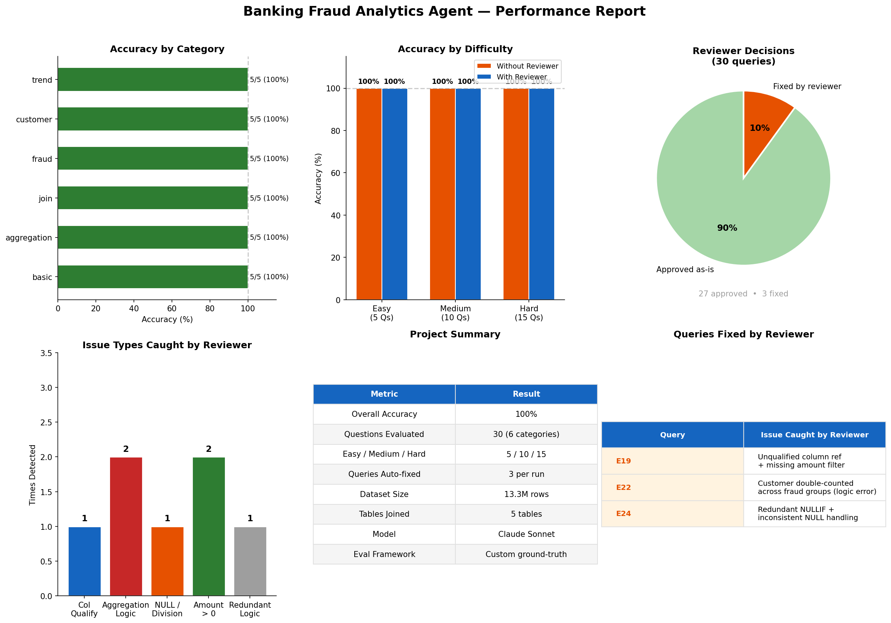

# 🏦 Banking Fraud Analytics Agent

A conversational Text-to-SQL data agent for banking fraud analysis, built with Claude API, DuckDB, and Streamlit. Ask questions in plain English and get SQL-powered insights on 13M+ real banking transactions.



## Features

- **Natural Language to SQL** — Ask any question about the fraud dataset; Claude generates and executes the SQL automatically
- **Adversarial Reviewer** — A second Claude instance reviews every SQL query before execution, catching GROUP BY errors, NULL handling issues, aggregation mistakes, and more
- **Conversation Memory** — Multi-turn dialogue support; follow-up questions like "just show the top 3" or "break that down by card type" reference previous context automatically
- **Eval Framework** — 30-question benchmark across 6 categories (basic, aggregation, join, fraud, customer, trend) with ground-truth SQL validation
- **Streamlit UI** — Interactive web app with real-time reviewer activity tracking

## Architecture


## Dataset

[Financial Transactions Dataset](https://www.kaggle.com/datasets/computingvictor/transactions-fraud-datasets) from Kaggle — a synthetic banking dataset covering the 2010s decade.

| Table | Rows | Description |
|-------|------|-------------|
| transactions | 13.3M | Core fact table with amount, merchant, payment method |
| cards | 6,146 | Card details per customer |
| users | 2,000 | Customer demographics and income |
| mcc_codes | 109 | Merchant category code descriptions |
| fraud_labels | 8.9M | Binary fraud labels (0.15% fraud rate) |

## Eval Results

| Metric | Result |
|--------|--------|
| Overall Accuracy | 96.7% – 100% across runs |
| Easy Questions | 5/5 (100%) |
| Medium Questions | 10/10 (100%) |
| Hard Questions | 14–15/15 (93–100%) |
| Queries Auto-fixed by Reviewer | 3–9 per run |

## Project Structure


## Setup

### 1. Clone and install dependencies

```bash
git clone https://github.com/IsabellaCcc/fraud-analytics-agent.git
cd fraud-analytics-agent
pip install anthropic duckdb pandas streamlit matplotlib python-dotenv kaggle
```

### 2. Download the dataset

```bash
kaggle datasets download -d computingvictor/transactions-fraud-datasets
unzip transactions-fraud-datasets.zip -d ./data
```

### 3. Configure environment

Create a `.env` file in the project root:
ANTHROPIC_API_KEY=your_api_key_here

### 4. Build the database

Run `01_setup.ipynb` end-to-end. This cleans the raw CSVs and loads all 5 tables into a local DuckDB database.

### 5. Run the app

```bash
streamlit run app.py
```

Open http://localhost:8501 in your browser.

## Example Queries

The agent handles everything from simple lookups to complex multi-turn analysis:

**Single-turn:**
- *"Which merchant categories have the highest fraud rates?"*
- *"Compare fraud rates for Visa vs Mastercard"*
- *"What is the average transaction amount by card type?"*

**Multi-turn:**
- *"Which states have the highest fraud rates?"*
- → *"Just show the top 3 and add absolute fraud counts"*
- → *"For those states, break it down by card type"*
- → *"Now show me fraud by hour of day instead"*
- → *"Filter to late night hours only (10pm to 4am)"*

## Tech Stack

- **Claude API** (claude-sonnet-4-5) — SQL generation, adversarial review, insight interpretation
- **DuckDB** — In-process analytical database for fast queries on 13M+ rows
- **Streamlit** — Web UI framework
- **Pandas** — Data manipulation and display
- **Matplotlib** — Eval results visualization
