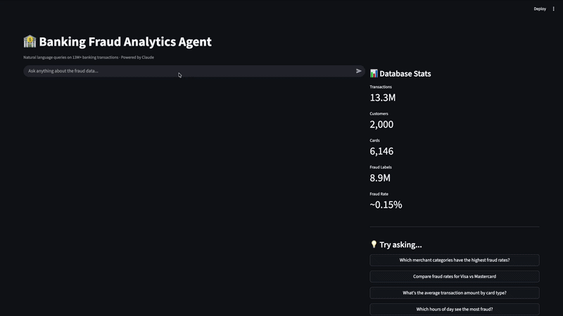

# 🏦 Banking Fraud Analytics Agent

A **multi-agent analytics system** that answers questions about 13M+ banking transactions in plain English. A generator agent writes SQL, an **adversarial reviewer agent** critiques and corrects it before execution, and a **30-question eval harness** measures accuracy across difficulty tiers. Built with the Claude API, DuckDB, and Streamlit.


This isn't just Text-to-SQL. It's a two-agent system (generator + adversarial reviewer) with conversation memory and a rigorous evaluation framework — the patterns that matter for production LLM systems: tool use, multi-agent coordination, and measurable quality.



## Why this is more than Text-to-SQL

| Pattern | How it shows up here |
| ------- | -------------------- |
| **Tool use** | The LLM decides on an action (a SQL query), executes it against a real 13M-row database, and reasons over the result — the core agentic primitive. |
| **Multi-agent coordination** | A second Claude instance acts as an adversarial reviewer, catching GROUP BY errors, NULL-handling bugs, and aggregation mistakes *before* execution. |
| **Memory** | Multi-turn dialogue: follow-ups like "just show the top 3" or "break that down by card type" resolve against prior context. |
| **Evaluation** | A 30-question benchmark with ground-truth SQL across 6 categories — the rarest and most valuable skill: proving the system actually works. |

## How it works

```
User question (plain English)
        │
        ▼
  Generator agent (Claude)  ──►  proposes SQL
        │
        ▼
  Adversarial reviewer (Claude)  ──►  critiques: GROUP BY? NULLs? aggregation?
        │                                   │
        │ approved                          │ flagged → corrected SQL
        ▼                                   ▼
  Execute against DuckDB (13M+ rows)
        │
        ▼
  Claude interprets results  ──►  natural-language insight (+ memory for follow-ups)
```

## Features

- **Natural Language to SQL** — Ask any question about the fraud dataset; the generator agent writes and executes the SQL.
- **Adversarial Reviewer** — A second Claude instance reviews every query before execution, auto-fixing common errors (3–9 queries auto-corrected per eval run).
- **Conversation Memory** — Multi-turn dialogue; follow-up questions reference previous context automatically.
- **Eval Framework** — 30-question benchmark across 6 categories (basic, aggregation, join, fraud, customer, trend) with ground-truth validation.
- **Streamlit UI** — Interactive web app with real-time reviewer-activity tracking.

## Eval Results

| Metric | Result |
| ------ | ------ |
| Overall Accuracy | 96.7% – 100% across runs |
| Easy Questions | 5/5 (100%) |
| Medium Questions | 10/10 (100%) |
| Hard Questions | 14–15/15 (93–100%) |
| Queries Auto-fixed by Reviewer | 3–9 per run |

The reviewer's auto-fix count is itself a result: it quantifies how often the adversarial step caught a bug the generator would have shipped.

## Dataset

[Financial Transactions Dataset](https://www.kaggle.com/datasets/computingvictor/transactions-fraud-datasets) from Kaggle — a synthetic banking dataset covering the 2010s.

| Table | Rows | Description |
| ----- | ---- | ----------- |
| transactions | 13.3M | Core fact table with amount, merchant, payment method |
| cards | 6,146 | Card details per customer |
| users | 2,000 | Customer demographics and income |
| mcc_codes | 109 | Merchant category code descriptions |
| fraud_labels | 8.9M | Binary fraud labels (0.15% fraud rate) |

## Tech Stack

- **Claude API** (claude-sonnet-4-5) — SQL generation, adversarial review, insight interpretation
- **DuckDB** — In-process analytical database for fast queries on 13M+ rows
- **Streamlit** — Web UI
- **Pandas** — Data manipulation and display
- **Matplotlib** — Eval results visualization

## Setup

### 1. Clone and install

```bash
git clone https://github.com/IsabellaCcc/fraud-analytics-agent.git
cd fraud-analytics-agent
pip install anthropic duckdb pandas streamlit matplotlib python-dotenv kaggle
```

### 2. Download the dataset

```bash
kaggle datasets download -d computingvictor/transactions-fraud-datasets
unzip transactions-fraud-datasets.zip -d ./data
```

### 3. Configure environment

Create a `.env` file in the project root:

```
ANTHROPIC_API_KEY=your_api_key_here
```

### 4. Build the database

Run `01_setup.ipynb` end-to-end. This cleans the raw CSVs and loads all 5 tables into a local DuckDB database.

### 5. Run the app

```bash
streamlit run app.py
```

Open <http://localhost:8501> in your browser.

## Example Queries

**Single-turn:**
- *"Which merchant categories have the highest fraud rates?"*
- *"Compare fraud rates for Visa vs Mastercard"*
- *"What is the average transaction amount by card type?"*

**Multi-turn (memory in action):**
- *"Which states have the highest fraud rates?"*
- → *"Just show the top 3 and add absolute fraud counts"*
- → *"For those states, break it down by card type"*
- → *"Now show me fraud by hour of day instead"*
- → *"Filter to late night hours only (10pm to 4am)"*

## Project Structure

```
fraud-analytics-agent/
├── 01_setup.ipynb              # Clean CSVs, load DuckDB
├── 02_agent.ipynb             # Generator + adversarial reviewer
├── 03_eval.ipynb              # 30-question eval harness
├── 04_visualization.ipynb     # Eval results plotting
├── 05_agent_with_memory.ipynb # Multi-turn memory
├── app.py                     # Streamlit UI
└── schema_docs/               # Table schema reference for the agent
```
